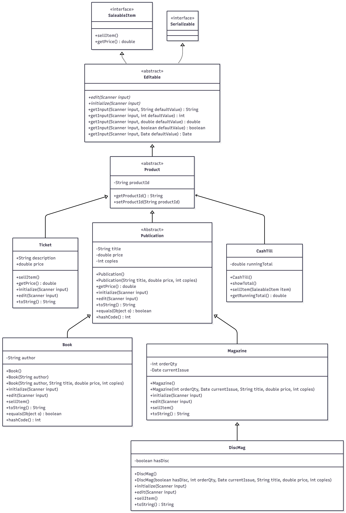

# Bookstore CLI Application
> [git repository: ](https://github.com/fcarella/bookstore-2026-06-09)

A console-based Java application for managing a bookstore inventory, performing sales, and tracking cash flow. This project demonstrates object-oriented programming concepts including inheritance, polymorphism, and interface implementation in Java 25.

## Key Updates (Since Version 2026-01-30)

*   **Type Migration (`double` to `Double`):** Price properties and their corresponding return types in `SaleableItem`, `Publication`, and `Ticket` have been migrated from primitive `double` to the object wrapper `Double`. This change enables support for nullable price fields and improves alignment with database wrappers.
*   **Java Platform:** The project compilation target has been updated to Java 25.
*   **Expanded Test Coverage:** Comprehensive unit tests have been added to validate the individual behavior of POJO subclasses (`Book`, `Magazine`, `DiscMag`, and `Ticket`) including input parsing and fallback defaults.

## Features

*   **Inventory Management:**
    *   **Books:** Managed with Title, Author, Price, and Copies.
    *   **Magazines:** Periodicals with Order Quantity and Issue Date.
    *   **Disc Magazines:** Specialized magazines that include an interactive disc.
    *   **Tickets:** Simple saleable items with a description and price.
*   **CRUD Operations:** Add, Edit, and Delete items from the inventory console.
*   **Sales System:** Sell items to decrement inventory counts (for Publications) and increase the running total in the Cash Till.
*   **Data Generation:** Uses `JavaFaker` to pre-populate the inventory with realistic mock data on startup.
*   **Menu System:** Interactive console menu for navigation.

## Class Hierarchy

The class structure implements the following relationships:
*   **SaleableItem (Interface):** Defines core methods `sellItem()` and `getPrice()`.
*   **Editable (Abstract):** Handles console input/output stream management and parsing helper methods.
*   **Publication:** Base class for Books and Magazines (Title, Price, Copies).

## Prerequisites

*   **Java JDK:** Version 25
*   **Maven:** 3.6+

## Dependencies

*   [JavaFaker](https://github.com/DiUS/java-faker) (1.0.2): For generating random test data on startup.
*   [JUnit 5](https://junit.org/junit5/) (5.10.0): For unit testing.

## How to Run

1.  **Compile the project:**
    ```bash
    mvn clean compile
    ```

2.  **Run the application:**
    ```bash
    mvn exec:java -Dexec.mainClass="bookstore.Main"
    ```

## Usage

Upon starting, the application populates the inventory with random data. You will see the following interactive menu:

```text
***********************
 1. Add Items
 2. Edit Items
 3. Delete Items
 4. Sell item(s)
 5. List items
99. Quit
***********************
```

*   **Add Items:** Choose a specific type (Book, Magazine, DiscMag, Ticket) and fill out the fields.
*   **Edit Items:** Select an index from the list to modify fields (leaving an entry blank keeps its current value).
*   **Sell Items:** Select an index to perform a sale. This decreases the `Copies` count (for Publications) and adds the item's price to the internal Cash Till.

## Running Tests

Unit tests are implemented using JUnit 5 to verify interactive console prompts, validation flows, and sales operations.

Run the tests using Maven:

```bash
mvn test
```

## Project Structure

```text
src/
├── main/
│   └── java/
│       └── bookstore/
│           ├── Main.java           # Entry point
│           ├── App.java            # Controller / Menu Logic
│           └── pojos/              # Data Models
│               ├── Editable.java
│               ├── SaleableItem.java
│               ├── Product.java
│               ├── Publication.java
│               ├── Book.java
│               ├── Magazine.java
│               ├── DiscMag.java
│               ├── Ticket.java
│               └── CashTill.java
└── test/
    └── java/
        └── bookstore/
            ├── AppTest.java        # Interactive menu automation test
            └── pojos/              # Unit Tests for specific models
                ├── BookTest.java
                ├── MagazineTest.java
                ├── DiscMagTest.java
                └── TicketTest.java
```
- A console-based Java application for managing a bookstore inventory, performing sales, and tracking cash flow. This project demonstrates object-oriented programming concepts including inheritance, polymorphism, and interface implementation in Java 24.

## Features

*   **Inventory Management:**
    *   **Books:** Manage items with Title, Author, Price, and Copies.
    *   **Magazines:** Manage periodicals with Order Quantity and Issue Date.
    *   **Disc Magazines:** Specialized magazines that include a disc.
    *   **Tickets:** Simple saleable items with a description and price.
*   **CRUD Operations:** Add, Edit, and Delete items from the inventory.
*   **Sales System:** Sell items to decrement inventory count and increase the Cash Till total.
*   **Data Generation:** Uses `JavaFaker` to populate the inventory with realistic dummy data.
*   **Menu System:** Interactive console menu for navigation.

## Class Hierarchy



The hierarchy implements the following structure:
*   **SaleableItem (Interface):** Defines `sellItem()` and `getPrice()`.
*   **Editable (Abstract):** Handles console input/output and parsing.
*   **Publication:** Base class for Books and Magazines (Title, Price, Copies).

## Prerequisites

*   **Java JDK:** Version 24
*   **Maven:** 3.6+

## Dependencies

*   [JavaFaker](https://github.com/DiUS/java-faker) (1.0.2): For generating random test data.
*   [JUnit 5](https://junit.org/junit5/) (5.10.0): For unit testing.

## How to Run

1.  **Compile the project:**
    ```bash
    mvn clean compile
    ```

2.  **Run the application:**
    ```bash
    mvn exec:java -Dexec.mainClass="csd214.bookstore.Main"
    ```

## Usage

Upon starting, the application will populate the list with random data. You will see the following menu:

```text
***********************
 1. Add Items
 2. Edit Items
 3. Delete Items
 4. Sell item(s)
 5. List items
99. Quit
***********************
```

*   **Add Items:** Choose a specific type (Book, Magazine, etc.) and follow the prompts.
*   **Edit Items:** Select an index from the list to modify fields.
*   **Sell Items:** Select an index to sell. This decreases the 'Copies' count (for Publications) and adds the price to the internal Cash Till.

## Running Tests

Unit tests are implemented using JUnit 5 to verify the logic of POJOs and input mocking.

Run the tests using Maven:

```bash
mvn test
```

## Project Structure

```
src/
├── main/
│   └── java/
│       └── csd214/
│           └── bookstore/
│               ├── Main.java           # Entry point
│               ├── App.java            # Controller / Menu Logic
│               └── pojos/              # Data Models
│                   ├── Editable.java
│                   ├── SaleableItem.java
│                   ├── Product.java
│                   ├── Publication.java
│                   ├── Book.java
│                   ├── Magazine.java
│                   ├── DiscMag.java
│                   ├── Ticket.java
│                   └── CashTill.java
└── test/
    └── java/
        └── csd214/
            └── bookstore/
                └── pojos/              # Unit Tests
```
